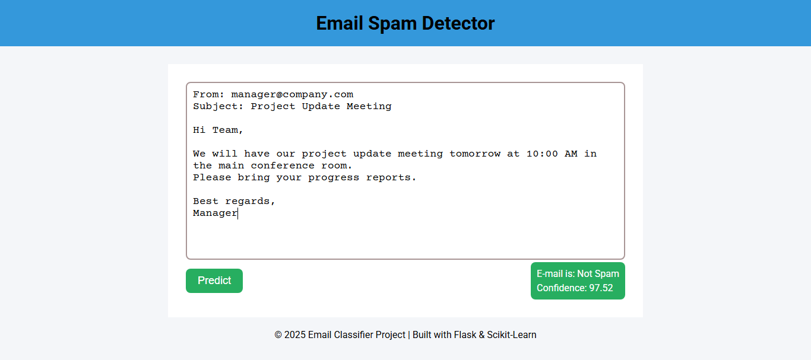

<p align="center">
  
</p>

## ✉ Email Classifier
A simple **Machine Learning + NLP** web app built with **Flask** that classifies emails as:
- 📩 Not Spam  
- 🚨 Spam  

---


---

### 📑 Table of Contents
- [Tech Stack](#-tech-stack)
- [How to Use](#-how-to-use)
- [Screenshots](#-screenshots)
- [Features](#-features)
- [Roadmap](#-roadmap)
- [Contributing](#-contributing)
- [License](#-license)
- [Contact](#-contact)

---

### 🚀 Tech Stack


---

### 📂 How to Use
1. Clone the repo
   ```bash
   git clone https://github.com/your-username/all-in-one-calculator.git
   ```
2. Navigate to the project folder
   ```bash
   cd all-in-one-calculator
   ```
3. Open `index.html` in your browser.

---


### 📸 Screenshots
| Home Page |
|-----------|
| 

---

### 📍 Roadmap
- Improve UI with modern design.
- Add database support to save classified emails.
- Deploy on cloud (Heroku / Render).
 
 ---

### ✨ Features
 
- 🧠 Uses NLP techniques (tokenization, TF-IDF) for text processing.
- 🤖 Machine Learning model trained on email dataset.
- 🔎 Classifies emails as Spam or Not Spam.
- 📊 Shows prediction with confidence score.
- 🌐 Simple web interface with HTML, CSS, JS + Flask.

<details>
  <summary>📌 Why use this project?</summary> This project is helpful for students and beginners learning **Flask + ML + NLP integration**.
</details>

---

### 🤝 Contributing

Contributions, issues, and feature requests are welcome!
Feel free to fork this repository and submit pull requests.

---

### 📜 License
This project is licensed under the [MIT License](./LICENSE).

---

### 📬 Contact
 [](mailto:cornerofcodes00@gmail.com)
[](https://www.linkedin.com/in/muhammad-muzammil-irshad-05b863333)
[](https://www.tiktok.com/@cornerofcodes)

---
